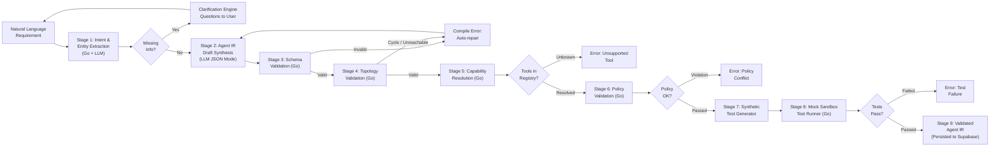

# 03 — Agent Compilation Pipeline Diagram

This diagram outlines the 9-stage compilation pipeline in **DelTix**, from natural language input to a validated, executable Agent IR (Left to Right).

```mermaid
flowchart LR
    Prompt["Natural Language\nRequirement"] --> Ingestion["Stage 1: Intent &\nEntity Extraction\n(Go + LLM)"]
    
    Ingestion --> CheckClarify{"Missing\nInfo?"}
    CheckClarify -->|Yes| Clarify["Clarification Engine\nQuestions to User"]
    Clarify --> Prompt
    
    CheckClarify -->|No| IRGen["Stage 2: Agent IR\nDraft Synthesis\n(LLM JSON Mode)"]
    
    IRGen --> SchemaVal["Stage 3: Schema\nValidation (Go)"]
    SchemaVal -->|Invalid| IRRepair["Compile Error:\nAuto-repair"]
    IRRepair --> IRGen
    
    SchemaVal -->|Valid| GraphVal["Stage 4: Topology\nValidation (Go)"]
    GraphVal -->|Cycle / Unreachable| IRRepair
    
    GraphVal -->|Valid| CapRes["Stage 5: Capability\nResolution (Go)"]
    CapRes --> CheckTools{"Tools in\nRegistry?"}
    CheckTools -->|Unknown| RejectTool["Error: Unsupported\nTool"]
    
    CheckTools -->|Resolved| PolVal["Stage 6: Policy\nValidation (Go)"]
    PolVal --> CheckPolicy{"Policy\nOK?"}
    CheckPolicy -->|Violation| RejectPolicy["Error: Policy\nConflict"]
    
    CheckPolicy -->|Passed| TestGen["Stage 7: Synthetic\nTest Generator"]
    TestGen --> TestRunner["Stage 8: Mock Sandbox\nTest Runner (Go)"]
    TestRunner --> CheckTests{"Tests\nPass?"}
    CheckTests -->|Failed| TestFix["Error: Test\nFailure"]
    
    CheckTests -->|Passed| FinalIR["Stage 9: Validated\nAgent IR\n(Persisted to Supabase)"]
```
