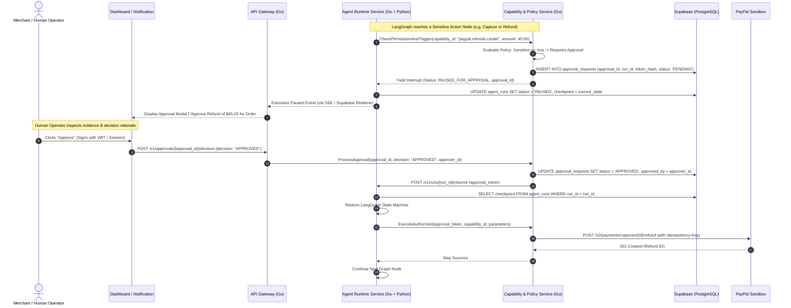

# 08 — Approval and Policy Flow Diagram

This sequence diagram depicts the human-in-the-loop interruption, approval token creation in Supabase, and resumption workflow in **DelTix**.

```mermaid
sequenceDiagram
    autonumber
    actor User as Merchant / Human Operator
    participant UI as Dashboard / Notification
    participant Gateway as API Gateway (Go)
    participant Runtime as Agent Runtime Service (Go + Python)
    participant PolicySvc as Capability & Policy Service (Go)
    participant DB as Supabase (PostgreSQL)
    participant PayPal as PayPal Sandbox

    Note over Runtime,PolicySvc: LangGraph reaches a Sensitive Action Node (e.g. Capture or Refund)
    Runtime->>PolicySvc: CheckPermissionAndTrigger(capability_id: "paypal.refunds.create", amount: 45.00)
    PolicySvc->>PolicySvc: Evaluate Policy: Sensitive == true -> Requires Approval
    
    PolicySvc->>DB: INSERT INTO approval_requests (approval_id, run_id, token_hash, status: 'PENDING')
    PolicySvc-->>Runtime: Yield Interrupt (Status: PAUSED_FOR_APPROVAL, approval_id)
    
    Runtime->>DB: UPDATE agent_runs SET status = 'PAUSED', checkpoint = current_state
    Runtime-->>Gateway: Execution Paused Event (via SSE / Supabase Realtime)
    Gateway-->>UI: Display Approval Modal ("Approve Refund of $45.00 for Order #123?")
    
    Note over User,UI: Human Operator inspects evidence & decision rationale
    User->>UI: Clicks "Approve" (Signs with JWT / Session)
    UI->>Gateway: POST /v1/approvals/{approval_id}/decision (decision: "APPROVED")
    
    Gateway->>PolicySvc: ProcessApproval(approval_id, decision: "APPROVED", approver_id)
    PolicySvc->>DB: UPDATE approval_requests SET status = 'APPROVED', approved_by = approver_id
    PolicySvc->>Runtime: POST /v1/runs/{run_id}/resume (approval_token)
    
    Runtime->>DB: SELECT checkpoint FROM agent_runs WHERE run_id = run_id
    Runtime->>Runtime: Restore LangGraph State Machine
    Runtime->>PolicySvc: ExecuteAuthorized(approval_token, capability_id, parameters)
    PolicySvc->>PayPal: POST /v2/payments/captures/{id}/refund (with Idempotency-Key)
    PayPal-->>PolicySvc: 201 Created (Refund ID)
    PolicySvc-->>Runtime: Step Success
    Runtime->>Runtime: Continue Next Graph Node
```
