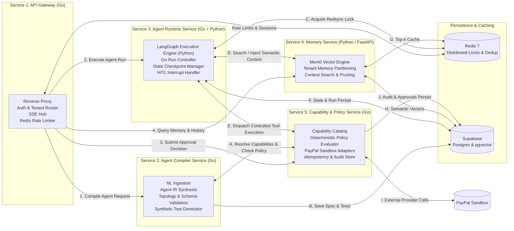

# 09 — Service Interaction Diagram

This diagram displays the synchronous and asynchronous communication topology between the five services of **DelTix**.

```mermaid
flowchart LR
    subgraph S1["Service 1: API Gateway (Go)"]
        GW["Reverse Proxy\nAuth & Tenant Router\nSSE Hub\nRedis Rate Limiter"]
    end

    subgraph S2["Service 2: Agent Compiler Service (Go)"]
        Compiler["NL Ingestion\nAgent IR Synthesis\nTopology & Schema Validation\nSynthetic Test Generator"]
    end

    subgraph S3["Service 3: Agent Runtime Service (Go + Python)"]
        Runtime["LangGraph Execution Engine (Python)\nGo Run Controller\nState Checkpoint Manager\nHITL Interrupt Handler"]
    end

    subgraph S4["Service 4: Memory Service (Python / FastAPI)"]
        Memory["Mem0 Vector Engine\nTenant Memory Partitioning\nContext Search & Pruning"]
    end

    subgraph S5["Service 5: Capability & Policy Service (Go)"]
        Policy["Capability Catalog\nDeterministic Policy Evaluator\nPayPal Sandbox Adapters\nIdempotency & Audit Store"]
    end

    subgraph Storage["Persistence & Caching"]
        Redis[("Redis 7\nDistributed Locks & Dedup")]
        Supabase[("Supabase\nPostgres & pgvector")]
    end

    GW -->|"1. Compile Agent Request"| Compiler
    GW -->|"2. Execute Agent Run"| Runtime
    GW -->|"3. Submit Approval Decision"| Policy
    GW -->|"4. Query Memory & History"| Memory
    GW <-->|"Rate Limits & Sessions"| Redis

    Compiler <-->|"A. Resolve Capabilities & Check Policy"| Policy
    Compiler -->|"B. Save Spec & Tests"| Supabase
    
    Runtime <-->|"C. Acquire Redsync Lock"| Redis
    Runtime <-->|"D. Search / Inject Semantic Context"| Memory
    Runtime <-->|"E. Dispatch Controlled Tool Execution"| Policy
    Runtime <-->|"F. State & Run Persist"| Supabase

    Memory <-->|"G. Top-k Cache"| Redis
    Memory <-->|"H. Semantic Vectors"| Supabase

    Policy <-->|"I. External Provider Calls"| PayPal[("PayPal Sandbox")]
    Policy -->|"J. Audit & Approvals Persist"| Supabase
```
