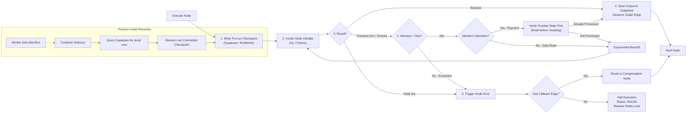

# 11 — Failure and Recovery Flow Diagram

This diagram visualizes failure detection, safe retry evaluations, checkpoint rollbacks, and process crash recovery in **DelTix** oriented Left to Right.

```mermaid
flowchart LR
    StartNode["Execute Node"] --> CheckpointBefore["1. Write Pre-run Checkpoint\n(Supabase: RUNNING)"]
    CheckpointBefore --> RunNode["2. Invoke Node Handler\n(Go / Python)"]
    RunNode --> ResultCheck{"3. Result?"}

    ResultCheck -->|Success| SaveSuccess["4. Save Output to Supabase\nAdvance Graph Edge"]
    SaveSuccess --> NextStep["Next Node"]

    ResultCheck -->|Transient 5xx / Timeout| EvalRetry{"4. Attempts < Max?"}
    
    EvalRetry -->|Yes| IdempotencyCheck{"Mutation Operation?"}
    IdempotencyCheck -->|Yes - Payment| ReconcileFirst["Verify Provider State First\n(Read before mutating)"]
    ReconcileFirst -->|Already Processed| SaveSuccess
    ReconcileFirst -->|Not Processed| Backoff["Exponential Backoff"]
    Backoff --> RunNode
    IdempotencyCheck -->|No - Safe Read| Backoff

    EvalRetry -->|No - Exceeded| FailStep["5. Trigger Node Error"]
    ResultCheck -->|Fatal 4xx| FailStep

    FailStep --> FallbackCheck{"Has Fallback Edge?"}
    FallbackCheck -->|Yes| RouteFallback["Route to Compensation Node"]
    RouteFallback --> NextStep
    FallbackCheck -->|No| SuspendFail["Halt Execution\nStatus: FAILED\nRelease Redis Lock"]

    subgraph CrashRecovery["Process Crash Recovery"]
        Crash["Worker Dies Mid-Run"] -.-> Reboot["Container Reboots"]
        Reboot --> Scan["Query Supabase for stuck runs"]
        Scan --> Restore["Restore Last Committed Checkpoint"]
        Restore --> CheckpointBefore
    end
```
